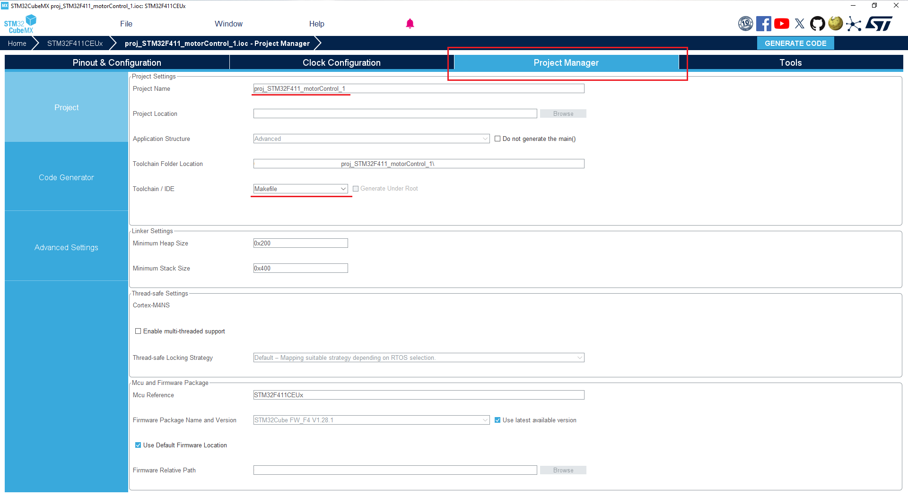
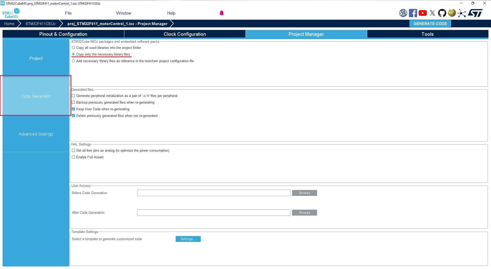
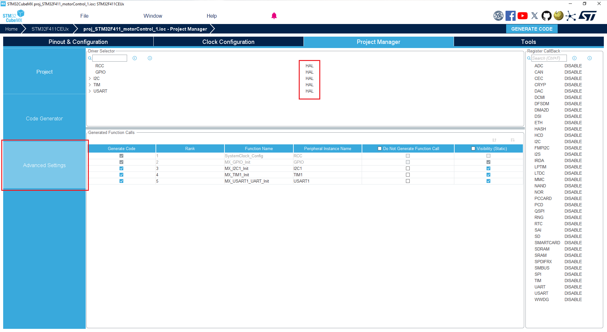
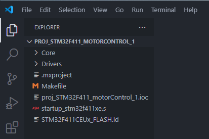
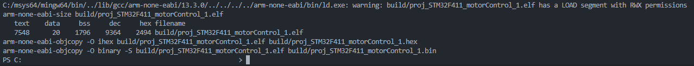
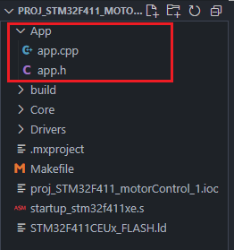
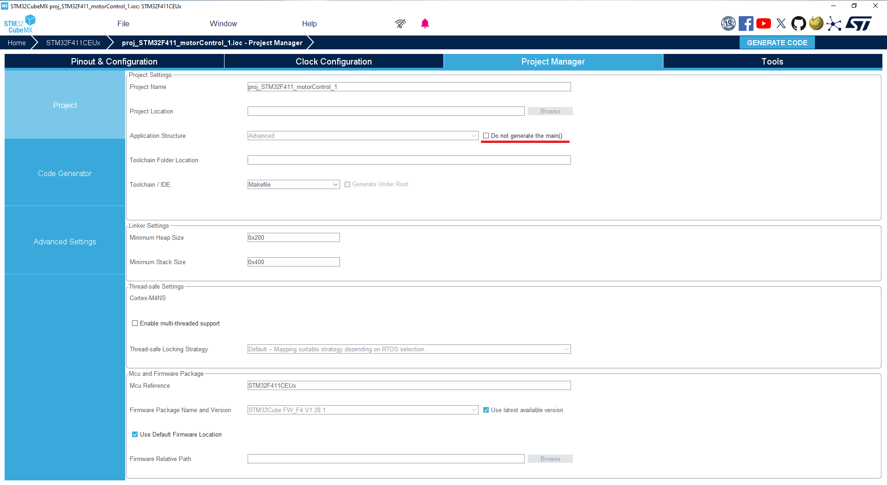
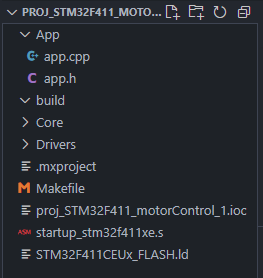
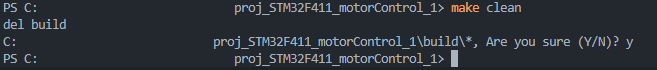

# COMPILING AND BUILDING C++ PROJECTS FOR STM32 USING MAKEFILE AND VSCODE

*written by Darstellar - October 2024*

#
## FIRST, THE PREREQUISITES _____ [ 1 ]
***PREREQUISITES*** are the things that are required in order for everything to operate correctly following this guide. With that said, make sure your system has every item in the following list. In the latter part, a guidance on ***VERIFYING*** and/or ***INSTALLING*** each item is going to be provided.

*If one already has all items in the following list ready and verified, one may proceed to section [ 2 ].*

##
### LIST OF PREREQUISITES:
1. GCC/G++ for C/C++: ***gcc*** and/or ***g++***.
2. GCC/G++ for ARM: ***arm-none-eabi-gcc*** and/or ***arm-none-eabi-g++***.
3. Make.
4. Software: ***STM32CubeMX***.
5. Software: ***Visual Studio Code***, of course :).

##
### CHECKING FOR AVAILABILITY OF PREREQUISITES:
1. For normal GCC/G++, launch a new terminal or command prompt and type:
`gcc --version` for GCC, and `g++ --version` for G++. The following demonstrates what it should look like to have GCC/G++ installed:

```
gcc (Rev1, Built by MSYS2 project) 14.2.0
Copyright (C) 2024 Free Software Foundation, Inc.
```

2. For ARM GCC/G++, launch a new terminal or command prompt and type: `arm-none-eabi-gcc --version` for ARM GCC, and `arm-none-eabi-g++ --version` for ARM G++. The following demonstrates what it should look like to have ARM GCC/G++ toolchain successfully installed:
```
arm-none-eabi-g++ (GCC) 13.3.0
Copyright (C) 2023 Free Software Foundation, Inc.
```

3. ***Make*** is required to compile STM32 projects with Makefiles. Launch a new terminal or command prompt and type `make --version`. If ***make*** is successfully installed, it should look like:
```
GNU Make 4.4.1
Copyright (C) 1988-2023 Free Software Foundation, Inc.
License GPLv3+: GNU GPL version 3 or later <https://gnu.org/licenses/gpl.html>
```

4. and 5. Softwares can be checked by yourself, assuming that you are not a dummy or someone who never touched a computer before.

##
### GETTING AND INSTALLING PREREQUISITES:
*If any of the first 3 prerequisites are missing, follow the following steps to attain and ready them for the projects. Be sure to check what is missing first using the above steps, and install only the ones unavailable on your system to avoid overlapping.*

##
#### Installing GCC/G++:
1. Install MSYS2 with this [link](https://github.com/msys2/msys2-installer/releases/download/2024-01-13/msys2-x86_64-20240113.exe).
2. Run the executable and follow the installation wizard. ***Be sure to remember the installation folder***.
3. After the installation, look for ***MSYS32*** terminal in your computer and launch it. How: On windows, press `Start` and type `MSYS`.
4. A new terminal should open. In that newly opened terminal, type `pacman -S mingw-w64-x86_64-toolchain`, then hit Enter. Upon asked for confirmation, as below, type ***Y*** then hit Enter to proceed.
```
Enter a selection (default=all):                just hit Enter here!
...
Proceed with installation? [Y/n]                type Y, then hit Enter
```
5. Wait for the installation in the terminal to complete.
6. After the installation, add the path to the system environment variables. For windows computer, open `Start` and type `env`. Open the ***Edit the system environment variables*** control panel item. Click on `Environment Variables`. Then in the section ***User variables***, select ***Path*** and click `Edit`. Click on `New`, then `Browse` and navigate to the GCC/G++ ***bin*** folder. By default:
```
C:\msys64\mingw64\bin
```
7. Click `OK` to confirm the toolchain location and add to the system environment variables.
8. Now your system should have GCC/G++ toolchain installed. Verify it by using the steps in the previous section: `gcc --version` and/or `g++ --version`.

##
#### Installing ARM GCC/G++ Toolchain:
0. If not already, install MSYS2 with this [link](https://github.com/msys2/msys2-installer/releases/download/2024-01-13/msys2-x86_64-20240113.exe).
1. Open the MSYS2 terminal by pressing `Start` and type `MSYS`.
2. In the newly opened terminal, type `pacman -S mingw-w64-x86_64-arm-none-eabi-toolchain` and hit Enter. Upon asked for confirmation, as below, type Y then hit Enter to proceed.
```
Enter a selection (default=all):                just hit Enter here!
...
Proceed with installation? [Y/n]                type Y, then hit Enter
```
3. Wait for the installation in the terminal to complete.
4. After the installation, add the path to the system environment variables. For windows computer, open `Start` and type `env`. Open the ***Edit the system environment variables*** control panel item. Click on `Environment Variables`. Then in the section ***User variables***, select ***Path*** and click `Edit`. Click on `New`, then `Browse` and navigate to the ARM GCC/G++ ***bin*** folder. By default:
```
C:\msys64\mingw64\arm-none-eabi\bin
```
7. Click `OK` to confirm the toolchain location and add to the system environment variables.
8. Now your system should have ARM GCC/G++ toolchain installed. Verify it by using the steps in the previous section: `arm-none-eabi-gcc --version` and/or `arm-none-eabi-g++ --version`.

##
#### Installing MAKE:
1. Launch ***Powershell*** by opening `Start` and type `Powershell`.
2. In the powershell terminal, type `Get-ExecutionPolicy` then hit Enter.
3. If returned `Restricted`, proceed to ***Step 4***, else if returned `AllSigned`, skip to ***Step 5***.
4. If returned `Restricted`, type `Set-ExecutionPolicy AllSigned` and hit Enter. Once done, verify again with `Get-ExecutionPolicy` and Enter. The terminal should return similarly:
```
AllSigned
```
5. Install ***Chocolatey*** by copying the following command to the terminal and hitting enter:
```
Set-ExecutionPolicy Bypass -Scope Process -Force; [System.Net.ServicePointManager]::SecurityProtocol = [System.Net.ServicePointManager]::SecurityProtocol -bor 3072; iex ((New-Object System.Net.WebClient).DownloadString('https://community.chocolatey.org/install.ps1'))
```
6. After the installation, verify if ***Chocolatey*** was installed successfully by typing `Choco` and hit Enter. The following demonstrates what it should look like to have ***Chocolatey*** successfully installed:
```
Chocolatey v2.3.0
Please run 'choco -?' or 'choco <command> -?' for help menu.
```
7. Now open a new terminal or command prompt with `Administrator's Priviledge`, then type `choco install make` and hit Enter.
8. Once finished, verify that ***Make*** was installed successfully by typing `make --version`. The following demonstrates what it should look like to have ***Make*** successfully installed:
```
GNU Make 4.4.1
Copyright (C) 1988-2023 Free Software Foundation, Inc.
License GPLv3+: GNU GPL version 3 or later <https://gnu.org/licenses/gpl.html>
```

#
## GENERATING CODE WITH STM32CUBEMX _____ [ 2 ]
***STM32CubeMX*** or Cube MCU Explorer is a tool developed by ST-Electronics that is used for configuring MCUs and Devboards by ST and generate code based on user's configurations. To save a lot of time, we shall use CubeMX to first configure the basics of STM32 MCUs, the basics of our projects, then generate the dependency codes. We can then use this generated code as a project to work with in VSCode.

*OMG I swear, CubeIDE is just ugly as f_ck it makes my eyes bleed every single f_cking time!*

This guide ***DOES NOT*** cover the basics of STM32CubeMX nor does it cover STM32 MCUs programming. By proceeding with this guide, you are assumed to have knowledge about and experience with the STM32Cube software and programming, either with CubeIDE, or with uKeilC.

##
### CHOOSING AND CONFIGURING MCU:
Just choose your STM32 MCU and configure the debug, pinout, clock, and peripherals as you normally would. For example, STM32F103C8T6 blue pill.

##
### GENERATING CODE WITH MAKEFILE:
1. After finished with the MCU configuration, head to the `Project Manager` tab:



2. Give your project a name.
3. Head down to the `Toolchain / IDE` drop-down, expand, and choose `Makefile`.
4. In the `Code Generator` section, change tick to `Copy only the necessary library files`:



5. ***(Optional)*** In the `Advanced Setup` section, choose your prefered configuration. We shall use HAL API in this guide so we will leave this part unmodified, but you can choose LL if you wish to:



6. Now we can generate the code with Makefile by clicking the `GENERATE CODE` button on the upper right corner.

#
## WORKING IN VISUAL STUDIO CODE _____ [ 3 ]
*In case you skipped the entire upper part, be sure you have the following installed:*
- gcc/g++;
- arm-none-eabi-gcc/g++;
- Make.

##
### LAUNCHING THE PROJECT IN VSCODE:
1. Go to the location of the project generated by STM32CubeMX in the previous section.
2. Open the project folder with VSCode:



3. To make sure *arm-none-eabi-g++* and *Make* are working correctly, launch a new terminal within VSCode and type `make` to compile the project.
4. If everything is working correctly, you should see an elf file, a hex file, and a bin file generated by Make in the newly created folder `build`. If struck with any errors at this step, make sure your Makefile is not modified by accident. Otherwise, check every prerequisite in section 1:



##
### MODIFYING THE PROJECT FOR C++ COMPILATION:
*If you paid attention when CubeMX finished generating the project code, you would notice that the project was generated in C language. CubeMX does not natively support C++ projects, but we can work around that by modifying the Makefile with some rules and flags.*

##
#### Adding a new folder with header and c++ source:
First, we shall attempt to add a new folder that contains a header file and a source file. This is usually the workflow if you do not want to have to write code directly into the `main.c` file generated by Cube.

*Let us face it and be honest, Cube is ugly, both in its GUI and its generated code. The main.c file is just a f_cking sh!thole of abomination.*

1. In the project folder, create a new sub-folder. This is where we will write code for the main program. You can choose any name, but we usually go with `App` for the folder name, for ***application*** :)



2. Create a header file and a C++ cource file and give them names. We will be sticking with `app.h` and `app.cpp`.
3. For C++ to work with C in STM32, in every header file that is meant for C++ sources, you have to add `extern C` curly braces. For example, here is the content of the `app.h` header file, which is meant for the C++ source file `app.cpp`. Note that `#include "main.h"` must be used so that the HAL APIs can be used with our user-defined code:
```cpp
#ifndef _APP_H_
#define _APP_H_

#ifdef __cplusplus
extern "C" {
#endif /* __cplusplus */


#include "main.h"

void setup();
void loop();


#ifdef __cplusplus
}
#endif /* __cplusplus */

#endif /* _APP_H_ */
```
4. In the header file, we declared the `void setup()` and `void loop()` functions that share the convention with ***Arduino coding***. In the `app.cpp` file, we defined them to look as if we were programming on the ***Arduino platform***:
```cpp
#include "app.h"


void setup()
{

}


void loop()
{
    
}
```
5. Now that we have the `void setup()` and `void loop()` functions, let's actually go ahead and add them to the `main.c` file so that they get called when the main program executes.
6. Expand the `Core` folder of the project, then expand the `Src` folder, and open the C source file `main.c`. If you cannot find `main.c`, make sure you ***DID NOT*** check the box `Do not generate the main()`, then regenerate code using CubeMX:



7. In `main.c`, add `#include "app.h` to pull our setup and loop functions:
```cpp
...
/* USER CODE END Header */
/* Includes ------------------------------------------------------------------*/
#include "main.h"

/* Private includes ----------------------------------------------------------*/
/* USER CODE BEGIN Includes */
#include "app.h"
/* USER CODE END Includes */

/* Private typedef -----------------------------------------------------------*/
...
```
8. Call `setup()` ***BEFORE*** the infinite loop in `main()`, as well as `loop()` ***WITHIN*** the infinite loop:
```cpp
...
int main(void)
{
    ...
    ...
  /* Initialize all configured peripherals */
  MX_GPIO_Init();
  MX_I2C1_Init();
  MX_TIM1_Init();
  MX_USART1_UART_Init();
  /* USER CODE BEGIN 2 */

  setup();  <--------------------------------- CALL setup()

  /* USER CODE END 2 */

  /* Infinite loop */
  /* USER CODE BEGIN WHILE */
  while (1)
  {

    loop(); <--------------------------------- CALL loop()
    
    /* USER CODE END WHILE */

    /* USER CODE BEGIN 3 */
  }
  /* USER CODE END 3 */
}
```

##
#### Modifying the Makefile:
Open the Makefile and follow.
1. ***ADD*** sources for C++, ***right beneath*** the `C_SOURCES`:
```Makefile
...
C_SOURCES =  \
Core/Src/main.c \
Core/Src/stm32f4xx_it.c \
...
Core/Src/syscalls.c 

# ------------------------------------------------ ADD THIS
CXX_SOURCES = \
App/app.cpp \
...
```

```Makefile
# The more C++ sources you have, the more you will have to add them here.

# Example:
CXX_SOURCES = \
App/app.cpp \
MotorDriver\motorDriver.cpp \
Encoder\encoderSPI.cpp \
...
```
2. ***ADD*** binaries for C++, as well as modify the `AS` binary:
```Makefile
...
#######################################
# binaries
#######################################
PREFIX = arm-none-eabi-

ifdef GCC_PATH
CC = $(GCC_PATH)/$(PREFIX)gcc
CXX = $(GCC_PATH)/$(PREFIX)g++ # --------------------------- ADD THIS
AS = $(GCC_PATH)/$(PREFIX)g++ -x assembler-with-cpp # --- MODIFY THIS
CP = $(GCC_PATH)/$(PREFIX)objcopy
SZ = $(GCC_PATH)/$(PREFIX)size
else
CC = $(PREFIX)gcc
CXX = $(PREFIX)g++ # --------------------------------------- ADD THIS
AS = $(PREFIX)g++ -x assembler-with-cpp # --------------- MODIFY THIS
CP = $(PREFIX)objcopy
SZ = $(PREFIX)size
endif
HEX = $(CP) -O ihex
BIN = $(CP) -O binary -S
...
```
3. ***ADD*** includes for C and C++. Note that every include folder must start with `-I`:
```Makefile
...
# C includes
C_INCLUDES =  \
-ICore/Inc \
-IDrivers/STM32F4xx_HAL_Driver/Inc \
-IDrivers/STM32F4xx_HAL_Driver/Inc/Legacy \
-IDrivers/CMSIS/Device/ST/STM32F4xx/Include \
-IDrivers/CMSIS/Include \
-IApp # ---------------------------------------------------- ADD THIS

# ----------------------------------------------------- ADD THIS ALSO
CXX_INCLUDES = $(C_INCLUDES) \
# add more cpp includes here...
...
```
```Makefile
# The more folders you make, the more you will have to add them here.
# Adding folders to C_INCLUDES will also make them available for C++ sources.
# However, adding folders to CXX_INCLUDES will only make them available for C sources.
# Therefore, for headers that should remain universally available, add them to C_INCLUDES.

# Example:
C_INCLUDES =  \
-ICore/Inc \
-IDrivers/STM32F4xx_HAL_Driver/Inc \
-IDrivers/STM32F4xx_HAL_Driver/Inc/Legacy \
-IDrivers/CMSIS/Device/ST/STM32F4xx/Include \
-IDrivers/CMSIS/Include \
-IApp \
-IMotorDriver \
-IEncoder

CXX_INCLUDES = $(C_INCLUDES) \
-IPrivateCPP \
-INonCBinaries
...
```
4. ***ADD*** compile flags for C++, ***right beneath*** flags for C:
```Makefile
...
# compile gcc flags
ASFLAGS = $(MCU) $(AS_DEFS) $(AS_INCLUDES) $(OPT) -Wall -fdata-sections -ffunction-sections
CFLAGS += $(MCU) $(C_DEFS) $(C_INCLUDES) $(OPT) -Wall -fdata-sections -ffunction-sections
ifeq ($(DEBUG), 1)
CFLAGS += -g -gdwarf-2
endif
CFLAGS += -MMD -MP -MF"$(@:%.o=%.d)"

# ---------------------------------------------------------- ADD THIS
CXXFLAGS = $(MCU) $(C_DEFS) $(CXX_INCLUDES) $(OPT) -Wall -fdata-sections -ffunction-sections
ifeq ($(DEBUG), 1)
CXXFLAGS += -g -gdwarf-2
endif
CXXFLAGS += -MMD -MP -MF"$(@:%.o=%.d)"
...
```
5. ***ADD*** objects for C++, ***right beneath*** objects for C, as well as rules for C++, ***right beneath*** rules for C, and ***MODIFY*** the build target:
```Makefile
...
#######################################
# build the application
#######################################
# list of objects
OBJECTS = $(addprefix $(BUILD_DIR)/,$(notdir $(C_SOURCES:.c=.o)))
vpath %.c $(sort $(dir $(C_SOURCES)))

# ---------------------------------------------------------- ADD THIS
OBJECTS += $(addprefix $(BUILD_DIR)/,$(notdir $(CXX_SOURCES:.cpp=.o)))
vpath %.cpp $(sort $(dir $(CXX_SOURCES)))
# -------------------------------------------------------------------

# list of ASM program objects
OBJECTS += $(addprefix $(BUILD_DIR)/,$(notdir $(ASM_SOURCES:.s=.o)))
vpath %.s $(sort $(dir $(ASM_SOURCES)))
OBJECTS += $(addprefix $(BUILD_DIR)/,$(notdir $(ASMM_SOURCES:.S=.o)))
vpath %.S $(sort $(dir $(ASMM_SOURCES)))

$(BUILD_DIR)/%.o: %.c Makefile | $(BUILD_DIR) 
	$(CC) -c $(CFLAGS) -Wa,-a,-ad,-alms=$(BUILD_DIR)/$(notdir $(<:.c=.lst)) $< -o $@

# --------------------------------------------------- AS WELL AS THIS
$(BUILD_DIR)/%.o: %.cpp Makefile | $(BUILD_DIR) 
	$(CXX) -c $(CXXFLAGS) -Wa,-a,-ad,-alms=$(BUILD_DIR)/$(notdir $(<:.cpp=.lst)) $< -o $@
# -------------------------------------------------------------------

$(BUILD_DIR)/%.o: %.s Makefile | $(BUILD_DIR)
	$(AS) -c $(CFLAGS) $< -o $@
$(BUILD_DIR)/%.o: %.S Makefile | $(BUILD_DIR)
	$(AS) -c $(CFLAGS) $< -o $@

# ------------------------------------------------------- MODIFY THIS
$(BUILD_DIR)/$(TARGET).elf: $(OBJECTS) Makefile
	$(CXX) $(OBJECTS) $(LDFLAGS) -o $@
	$(SZ) $@
# -------------------------------------------------------------------

$(BUILD_DIR)/%.hex: $(BUILD_DIR)/%.elf | $(BUILD_DIR)
	$(HEX) $< $@
$(BUILD_DIR)/%.bin: $(BUILD_DIR)/%.elf | $(BUILD_DIR)
	$(BIN) $< $@	
	
$(BUILD_DIR):
	mkdir $@
...
```
6. Finally, if you are on a windows system, ***MODIFY*** the `make clean` rule from `-rm -fR $(BUILD_DIR)` to `-del $(BUILD_DIR)`:
```Makefile
...
#######################################
# clean up
#######################################
clean:
	-del $(BUILD_DIR) # --------------------------------- MODIFY THIS
...
```
7. Make sure your modifications to the ***Makefile*** were valid. Open a new terminal in VSCode, type `make` and hit Enter. If everything compiles without a problem, a hex file, a bin file will be generated to a newly created folder `build`:


8. ***(Optional)*** Afterward, check if `make clean` works properly. Upon typing `make clean` to the terminal, hit Enter to see if the `build` folder is emptied completely:




#
## CONCLUSION _____ [ 4 ]
We also provided a sample Makefile following this guide.

For uploading to STM32MCU, you can use an ST-Link device, with STM32CubeProgrammer, or ST-Link Utilities software.# STM32-Makefile-Guidance


